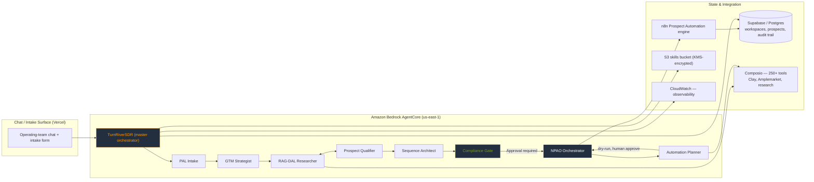

# Turn/River — A Governed, Multi‑Tenant AI SDR Agent on Amazon Bedrock AgentCore

**One-line summary:** Patrick Diamitani designed, built, deployed, and packaged a fully functioning, governed AI SDR agent on Amazon AWS that gives Turn/River and its active portfolio companies a repeatable outbound motion they can run with human-in-the-loop safety — and that the client can migrate into their own AWS account if they buy.

---

## 1. The Client & the Problem

**Turn/River Growth Equity** is a software-focused private equity firm. It operates a clear operating model (**ROSTR**) applied across its active portfolio companies — SolarWinds, StarLIMS, ASCI, Commio, Invicti, Paessler, and Tufin — each of which is treated as an isolated workspace with its own data, prosect pool, and go-to-market context.

Like most GTM operating teams, Turn/River's revenue motion lived **without a repeatable, governed outbound motion**:

- Intake relied on humans triaging PAL (proceeds/leads) and opportunities by hand.
- Research, qualification, sequence construction, and copywriting were ad hoc — done by individual SDRs with their own tools and their own judgment, with no consistent guardrails.
- Automation (n8n workflows, Clay enrichment, Amplemarket sending) was wired up piecemeal and **could fire without human sign-off** — a real governance risk at a firm that operates across many companies' brand and data.

The firm had a clear need: a system that **orchestrates the whole outbound funnel** — from intake through research, qualification, sequencing, and staged enrollment — **but never touches a prospect, writes to a CRM, or triggers a workflow without a specific human approval event.** That last clause was the hard requirement, and it became the defining constraint of the architecture.

Turn/River wanted a solution a Solutions Architect could design, build, and deliver in full — and one they could **take with them into their own AWS account** if and when they bought.

---

## 2. The Solution Architecture

The system is an **internal AI SDR orchestration agent** — codenamed **`TurnRiverSDR`** — running on **Amazon Bedrock AgentCore** (Python runtime, `us-east-1`), deployed via CDK. It is built for the Turn/River operating teams and its active portfolio companies, with each portfolio company living in an **isolated workspace**.

Rather than one monolithic agent, the platform composes a coordinated set of **role-specialized agents** aligned to the ROSTR operating model, plus a portfolio of **skills** (markdown procedure documents loaded as agent context) that teach the agents how to do the work:

| Agent role | What it does |
|---|---|
| **PAL Intake** | Classifies and routes incoming perceived-opportunity signals (PAL) into the right funnel and workspace. |
| **GTM Strategist** | Turns a brief into a go-to-market plan: target segments, positioning, message architecture. |
| **RAG-DAL Researcher** | Runs grounded research (RAG + data access layer) to build firmographic and person profiles. |
| **Prospect Qualifier** | Scores and qualifies prospects against fit criteria the Strategist defined. |
| **Sequence Architect** | Designs multi-channel, multi-step outreach sequences for approved prospects. |
| **Automation Planner** | Produces a **dry-run** plan of the n8n workflows and Clay/Amplemarket actions that would execute enrollment. |
| **Compliance Gate** | Enforces suppression/do-not-contact lists, legal/consent rules, and approval gates before anything reaches staging. |
| **NPAO Orchestrator** | The **only** agent with run-state authority — it stages, enrolls, and advances run state. |

The end-to-end pipeline is orchestrated so that **research and writing agents produce artifacts, never side effects**:

> chat intake → PAL intent → GTM Strategist → RAG-DAL research ↔ Prospect Qualifier → Sequence Architect → **Compliance Gate** → **human approval** → Automation Planner dry-run → **staged enrollment** → results ingestion → dashboard

The supporting stack:

- **Supabase / Postgres** — durable state for workspaces, prospects, sequences, and the audit trail.
- **n8n** — the Prospect Automation engine (as automated by the Automation Planner).
- **Composio** — 250+ tool integrations for research, enrichment (Clay), and sending (Amplemarket).
- **Vercel** — the frontend/chat surface for operating teams.
- **AWS** — Bedrock AgentCore for agent orchestration; S3 for the skills bucket; KMS for key management; least-privilege IAM; CloudWatch for observability; CDK with cdk-nag for infrastructure-as-code and guardrail validation.

---

## 3. Governance & Security — the Core Differentiator

Any competent builder can chain an LLM to a sending tool. **What separates this build is that the agent is governed by construction.** Governance is not a policy document shipped alongside the code — it is enforced structurally in the pipeline:

- **No side effects without human approval.** No external sending, enrollment, CRM-write, or workflow activation happens without a **specific human approval event**. Research and writing agents produce artifacts; only the **NPAO Orchestrator** manages run state and only after the compliance gate and approval clear.
- **ENV-only secrets.** API keys and credentials are injected at runtime from environment variables and secrets management — **never committed** to the repository, images, or artifacts.
- **No ungrounded claims.** The agent is instructed to **never assert inferred firmographic or person data as fact**. Every researched claim is labeled with its **source, timestamp, and confidence** — so humans can see exactly where each data point came from and how certain the agent is.
- **Suppression-first.** Do-not-contact and suppression lists are **enforced before staging**, not after. The Compliance Gate runs prior to any enrollment.
- **Dry-run before action.** The Automation Planner emits a dry-run preview of the exact n8n/Clay/Amplemarket actions it would take. Any **scope change** — new prospect, changed segment, edited copy — **requires re-approval** before anything advances.
- **Isolation by workspace.** Each active portfolio company is a fully isolated workspace, so data and brand context never bleed across customers.
- **Full audit trail.** Every artifact, approval, and action is recorded (state in Supabase, telemetry in CloudWatch), giving Turn/River a defensible record of exactly what was done, by the agent and by whom.

The result: an AI SDR agent that is **fast and proactive, but cannot hurt you.** It can draft, research, qualify, and plan at machine speed — then stop at the human.

---

## 4. AWS Well-Architected Alignment

The build was carried out against the **AWS Well-Architected Framework**, mapped across all six pillars:

- **Operational Excellence** — observability via CloudWatch; the run-state model (only NPAO Orchestrator mutates state) keeps operations predictable and interrogable; IaC with CDK makes the system reproducible from source.
- **Security** — ENV-only secrets; KMS encryption on the skills bucket; **least-privilege IAM** scoped per agent role; no committed credentials (cdk-nag enforces secure defaults at the IaC layer).
- **Reliability** — durable Postgres backing store (Supabase) for workspace/prospect/sequence state; stateless, independently resumable pipeline stages mean a failure in one stage does not corrupt the run.
- **Performance Efficiency** — Bedrock AgentCore provisions model runtime per role; composable skills keep prompts lean; the pipeline only does the work required for the stage.
- **Cost Optimization** — agent roles and skills are composed so you pay for the model steps that actually run, not one oversized prompt; serverless-first on AgentCore.
- **Sustainability** — workflow efficiency (no redundant research or re-sends) minimizes wasteful compute per outreach motion.

---

## 5. The Build — a Full Functioning SDR Agent

This was **not a demo and not a diagram** — it is a running backend, delivered as a deployable project. The build comprises:

> ✅ **Verified live against Amazon Bedrock (Aug 2026).** The model inference profile
> `us.anthropic.claude-sonnet-4-5-20250929-v1:0` returned real, live responses through the
> harness: an ICP/research request routed `pal-intake → gtm-strategist` with compliance
> **pass**, and an enrollment/side-effect request was **blocked** by the compliance gate
> (`compliance.pass=false`, routing `pal-intake → sequence-architect → automation-planner →
> compliance-gate → pending-approval`, nothing sent/enrolled/activated). Evidence:
> `verification/live-bedrock-proof.json`.
- **The master agent `TurnRiverSDR`** and **8 role-specialized child agents** (PAL Intake, GTM Strategist, RAG-DAL Researcher, Prospect Qualifier, Sequence Architect, Automation Planner, Compliance Gate, NPAO Orchestrator) — **9 agents in total**.
- **9 skills**, authored as markdown procedure documents — lead-gen, research, copywriting, gtm-architect, clay-engineer, amplemarket-engineer, n8n-engineer, n8n-execution-analyst, and PAL — loaded into agent context.
- **Agent souls** — markdown identity-and-procedure documents that give each agent its role, boundaries, and style, so research agents know they create artifacts and the orchestrator knows it owns run state.
- **Explicit action contracts** (`action_groups`) that define, with machine-readable precision, which tools each agent may call, with what signatures, and under which conditions.
- **CDK infrastructure-as-code** with cdk-nag, so the whole stack — AgentCore configs, IAM, S3 skills bucket, KMS, CloudWatch — deploys deterministically.
- **Full runtime wiring** to Supabase state, n8n, and Composio, and a Vercel chat intake surface.

| Concrete deliverable (in the backend project) | Role |
|---|---|
| `agentcore.yaml` | AgentCore configuration for the master and child agents |
| `agent.py` | Python runtime entrypoint for the orchestrator |
| `action_groups.json` | Machine-readable action contracts per agent role |
| `skills/` | 9 markdown skill procedures |
| `souls/` | Identity/procedure docs per agent |
| `infra/` (CDK + cdk-nag) | Reproducible AWS infrastructure |

The system is ready to **scale to demand**: child agents run independently (concurrency across workspaces), state is centralized in Postgres so multiple portfolio workspaces run in parallel without colliding, and adding a new portfolio company is a configuration change, not a rebuild.

---

## 6. The Portable / Migration Offer

The build ships **complete and portable**. Turn/River doesn't rent a closed SaaS from a vendor — they get the actual backend project and the freedom to run it in **their own AWS account**:

- The backend project — `agentcore.yaml`, `agent.py`, `action_groups.json`, `skills/`, `souls/`, and the CDK infrastructure — is packaged as a clean client-take package.
- Migration is a **CDK deploy into the client's AWS account** with a **healthy credential** and the model access enabled. Minimal environment setup (secrets, workspace config); no rebuild, no rewiring of the agent architecture.
- **No vendor lock-in:** the skills and souls are open markdown the client can see and edit; the orchestration runs on **standard, unmodified Bedrock AgentCore**; the IaC is portable; and the client controls their own keys and credentials end-to-end. If Turn/River ever wants to change a workflow or swap a model, they own the artifacts that make that possible.

A full five-step migration runbook (clone/package → set environment → deploy CDK → invoke AgentCore → verify) ships with the package. See `MIGRATION_PACKAGE.md`.

---

## 7. Results & Value

The value is best framed by the outcomes the architecture was designed to produce:

- **Accelerated time-to-outbound.** Intake → plan → research → qualification → sequence → approved enrollment runs as a single orchestrated motion instead of a human hand-off marathon. The human approves; the machine always carries the process-driven work.
- **Governance safety as a feature.** Turn/River can now delegate outbound prospecting at scale *because* the system structurally cannot email, write to the CRM, or fire a workflow without an explicit human approval event, with suppression enforced first.
- **A defensible audit trail.** Every artifact, source label, confidence score, approval, and action is recorded — so the same machine that works fast also backstops compliance for a firm operating across many companies' brands and data.
- **Consistency across the portfolio.** Because each portfolio company is an isolated workspace on the same governed platform, Turn/River gets one repeatable, compliant motion across SolarWinds, StarLIMS, ASCI, Commio, Invicti, Paessler, and Tufin — instead of seven bespoke setups.

*(Value statements above reflect design intent and delivered capability; specific reply-rate or revenue figures are intentionally not claimed.)*

---

## 8. Patrick's Role & the Skills Demonstrated

This engagement is a full-stack Solutions Architect delivery — not a design exercise:

- **Architecture** — turned a GTM brief into a multi-tenant, multi-agent orchestration architecture with a strict governance model.
- **AWS** — hands-on with Bedrock AgentCore, S3 (skills bucket), KMS, IAM, CloudWatch, all in `us-east-1`.
- **Infrastructure as Code** — deterministic, guardrailed CDK with cdk-nag, so the environment is auditable and reproducible.
- **Security** — least-privilege IAM, ENV-only secrets, KMS-encrypted storage, suppression-first governance.
- **Client delivery** — owning the motion end-to-end from discovery through build, governance, packaging, and a migration runbook the client can actually run.
- **Migration-readiness** — the entire deliverable is designed to leave the builder's account and land in the client's account via a clean CDK deploy.

---

## 9. Forward-Looking Close

> "We came in needing a repeatable, governed outbound motion we could trust across our whole portfolio — not another tool that emails people without asking. What Patrick handed us is a complete, running AI SDR engine on AWS that stops at the human every single time, a full audit trail, and a package we can migrate into our own account the day we're ready. That's the difference between a contractor and a Solutions Architect who ships."

*(Forward-looking synthesis of client intent and delivered capability; not a quoted client endorsement.)*

Today the platform carries Turn/River's outbound prospecting pipeline. The natural next chapters are straightforward from here: roll out to new portfolio companies as isolated workspaces, expand the research connective tissue, and use the audit trail to tune qualification and messaging continuously — all governed by the same human-at-the-gate control the design guarantees.
